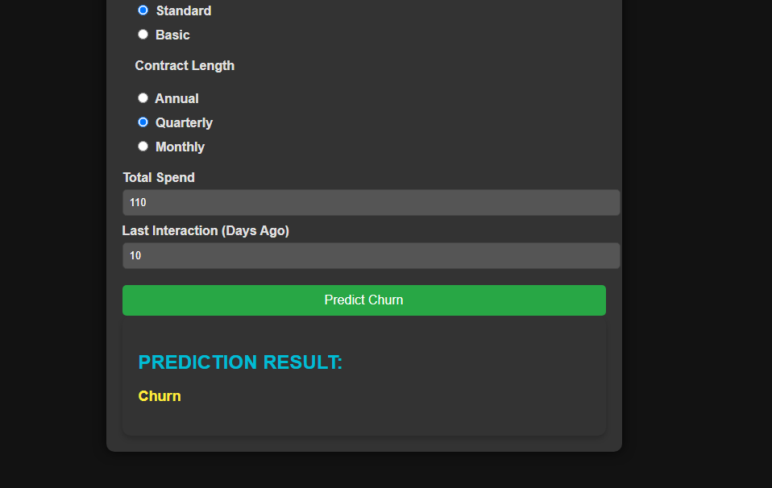

# Customer Churn Prediction Model

🚀 **Predict whether a customer will continue their subscription or churn using Machine Learning!**

## 📌 Overview
This project builds a **Customer Churn Prediction Model** using **Random Forest** with **hyperparameter tuning (Optuna)**. The model analyzes customer data (like subscription type, payment delays, and interactions) to predict whether they will leave the platform or continue.

Businesses like **Netflix, Spotify, and other OTT platforms** use similar models to identify potential churners and offer targeted discounts or promotions to retain them.

## 📝 Dataset
The dataset contains **450K rows** with features like:
- **Customer Demographics**: Age, Gender
- **Subscription Details**: Subscription Type, Contract Length
- **Engagement**: Tenure, Support Calls, Last Interaction
- **Payment Behavior**: Payment Delays, Total Expenses

## ⚙️ Technologies Used
- Python
- Pandas, NumPy, Matplotlib
- Scikit-learn (Random Forest)
- Optuna (Hyperparameter Tuning)
- Flask (for Web UI)

## 🔥 Model Performance
✅ **Accuracy:** 99%
✅ **Optimized with Optuna** for better performance
✅ **Handles large datasets (450K rows) efficiently**

## 🖥 Installation
1. Clone the repository:
   ```bash
   git clone https://github.com/nikitbisht/Customer-Churn-Prediction.git
   cd customer-churn-prediction
   ```
2. Install dependencies:
   ```bash
   pip install -r requirements.txt
   ```
3. Run the Flask app:
   ```bash
   python app.py
   ```

## 🚀 Usage
1. Open the web app in your browser: **http://127.0.0.1:5000/**
2. Upload customer data or manually input details
3. Click **Predict** to check if a customer is likely to churn
4. The app will display **CHURN/ NO CHURN**

## 📸 Screenshots
### **🏠 Home Page**


### **📊 Prediction Result**
_When clicking on "Predict" button:_


## 📜 License
This project is open-source under the MIT License.
